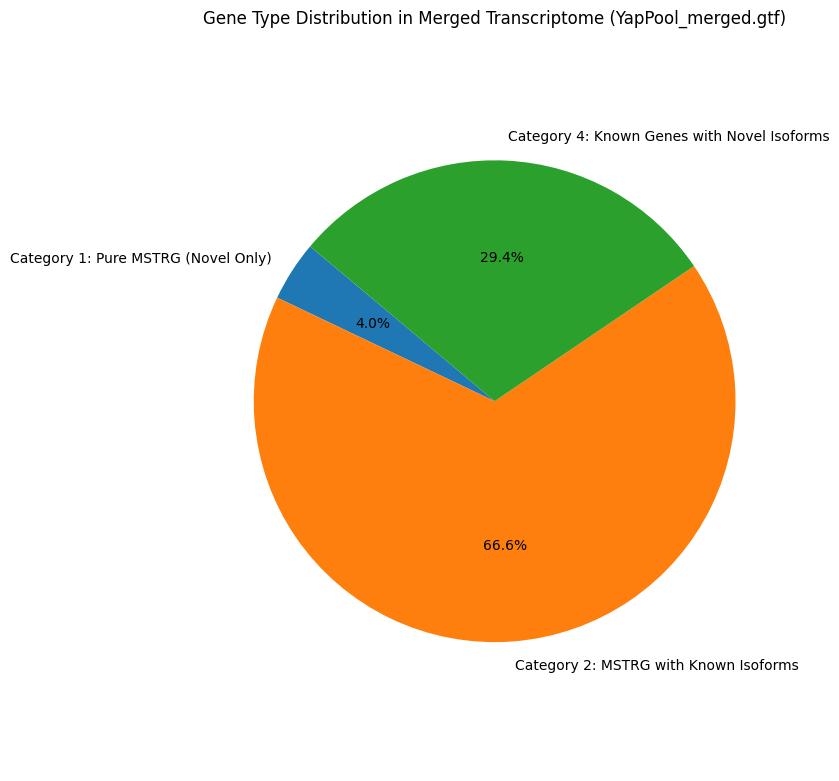
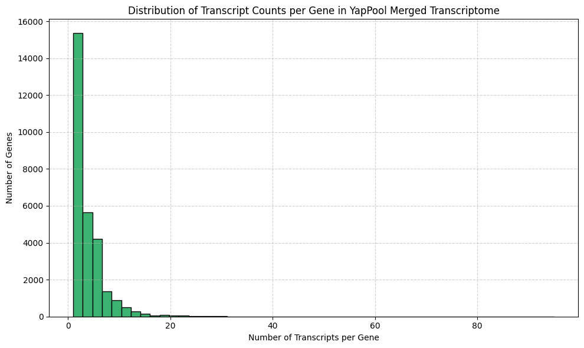
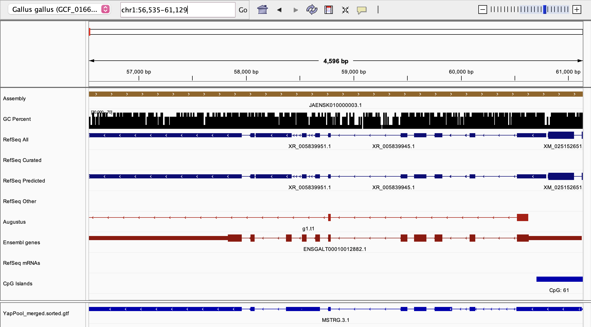
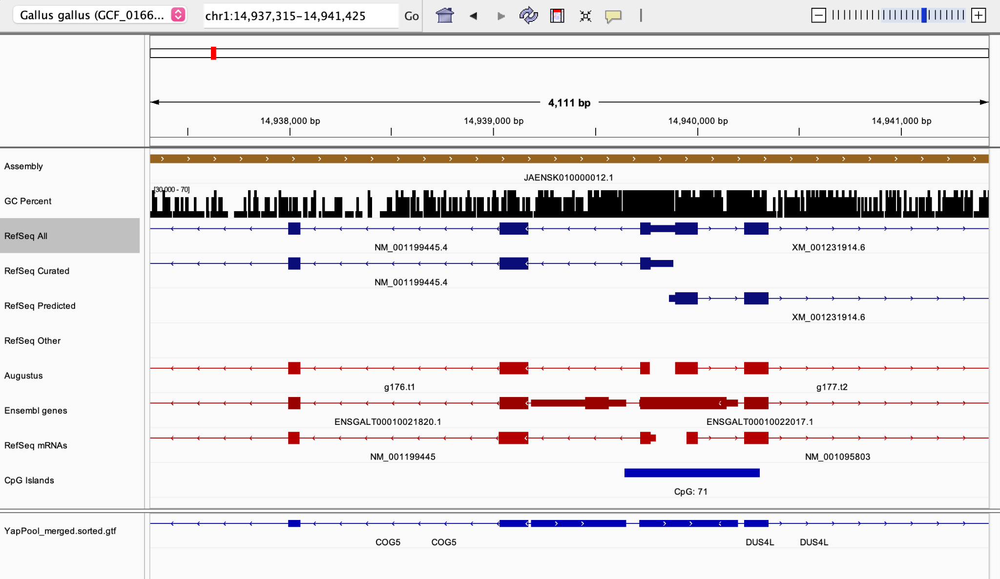

# 🐔 Structural Analysis of Chicken Transcriptome (YapPool RNA-Seq)

This project investigates transcript structures and alternative splicing in the chicken (*Gallus gallus*) genome using RNA-Seq data from the YapPool transcriptome. Through custom parsing of GTF annotations, transcript classification, and structural visualization, this work identifies novel isoforms and characterizes Category 1 transcripts — those that overlap with known reference genes but may differ in exon composition or boundaries.

---

## Project Objectives

- Parse and classify transcripts using merged GTF annotation
- Identify Category 1 novel transcripts overlapping reference genes
- Analyze exon-level structures of transcripts across genes
- Visualize transcript and exon complexity across the chicken genome (GRCg7b)
- Validate selected isoforms using IGV (Integrative Genomics Viewer)

---

## 🔗 Google Colab Notebook

[Open in Colab](https://colab.research.google.com/drive/18rvv6fSdTu-DZ0AnOi12ygpJjXKqMLdY?usp=sharing)  
_Run the full pipeline without installing anything locally._

---

## Reference Genome & Datasets

- **Reference Genome:** `Gallus_gallus.bGalGal1.mat.broiler.GRCg7b.113.gff3`
- **Transcriptome:** `YapPool_merged.gtf` (merged RNA-Seq transcript assembly)
- **Classification:** `YapPool_Transcript_Categories.xlsx` (Category 1–3 assignments)

---

## 📂 Project Structure

├── ResTask02_1.ipynb # Main notebook: Transcriptome Annotation and Alternative Splicing Analysis

├── YapPool_merged.gtf # Merged transcriptome annotation ( https://drive.google.com/file/d/1CCfbLELx253k02_IbV-1UEMWHdoZuwFA/view?usp=sharing )

├── Gallus_gallus.bGalGal1.mat.broiler... # Reference GFF3 annotation ( https://drive.google.com/file/d/1PAub4X8PKvhM1s1F5Wnmmdhh7JPDOOsS/view?usp=sharing )

├── YapPool_Transcript_Categories.xlsx # Transcript category labels (C1, C2, C3)

│ ├── Gene_Type_Dist.png # Distribution of gene types

│ ├── Dist_of_Transcriptomes.png # Transcript length and abundance plots

│ ├── fig1b.png # Exon structure of high-isoform gene

│ └── fig10.png # IGV-based transcript validation

---

## 📈 Key Figures

### Category & Gene Type Distributions  

### Transcript Complexity  
 

### Exon Structures of Highly Spliced Genes  
  

*Figure 1. Overlap between novel transcript MSTRG.3.1 and known Ensembl gene ENSGALT00010012882.1 on chr1 (56,535–61,129 bp).
The novel transcript discovered from RNA-Seq closely mirrors the structure of a known gene, including exon-intron boundaries and strand orientation. This supports its classification as a novel isoform or rediscovery of an existing gene under a new identifier due to assembly-driven transcript labeling.*

### IGV Screenshot – Novel vs. Reference  
  

*Figure 10. Readthrough transcript connecting COG5 and DUS4L across multiple gene annotations on chr1 (14,937,315–14,941,425 bp).
The StringTie assembly includes a transcript that bridges two annotated genes, COG5 and DUS4L, overlapping multiple Ensembl and RefSeq predictions and passing through a CpG island. This readthrough pattern may represent a functional bicistronic transcript, an unannotated fusion, or a regulatory variant, highlighting the dynamic complexity of gene expression in this region.*

---

## Highlights

- Category 1 transcripts show extensive overlap with reference genes, often revealing novel isoforms.
- Multiple genes exhibit high transcript diversity with clear splicing variants.
- Visualization tools like **IGV** and **matplotlib** enhance interpretability of exon-level structures.

---

## How to Run

1. Open the notebook in Colab
2. Mount your Google Drive
3. Upload `.gtf`, `.xlsx`, and `.gff3` files to the expected paths
4. Run all cells to generate summaries and figures

---

## Author

**Hera Dashnyam**  
Undergraduate Researcher — Bioinformatics & Environmental Science  
Miami University  
📬 dashnym@miamioh.edu | [LinkedIn](https://www.linkedin.com/in/hera-d/)

---

## Citation

If this project supports your research, please cite:

> Dashnyam, H. (2025). *Structural Analysis of Chicken Transcriptome (YapPool RNA-Seq)*. GitHub Repository. https://github.com/maralguadashnyam/StructuralAnalysisOfChickenTranscriptome-YapPool-RNA-Seq

---

## License

MIT License — open for educational and academic use.
